# VirtualService Operator - Architecture Deep Dive

## Overview

The VirtualService Operator is a Kubernetes controller that automatically manages Istio VirtualServices based on Service resources. This document provides a comprehensive technical deep dive into the operator's architecture, design patterns, and implementation details.

## System Architecture

### High-Level Architecture

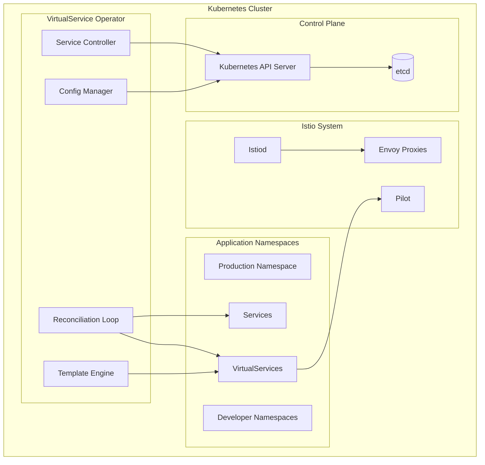

### Component Architecture

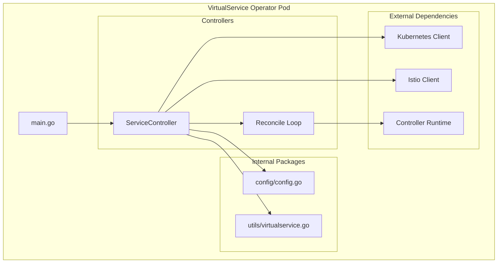

## Core Components

### 1. Service Controller

The Service Controller is the heart of the operator, implementing the controller-runtime pattern.

#### Controller Structure
```go
type ServiceReconciler struct {
    client.Client
    Scheme *runtime.Scheme
    Config *config.OperatorConfig
}
```

#### Key Responsibilities
- **Service Watching**: Monitors Service resources across all namespaces
- **Event Processing**: Handles Service create, update, and delete events
- **VirtualService Management**: Creates, updates, and deletes VirtualServices
- **Placeholder Management**: Creates placeholder services when needed
- **Conflict Resolution**: Handles concurrent modifications with retry logic

#### Reconciliation Flow
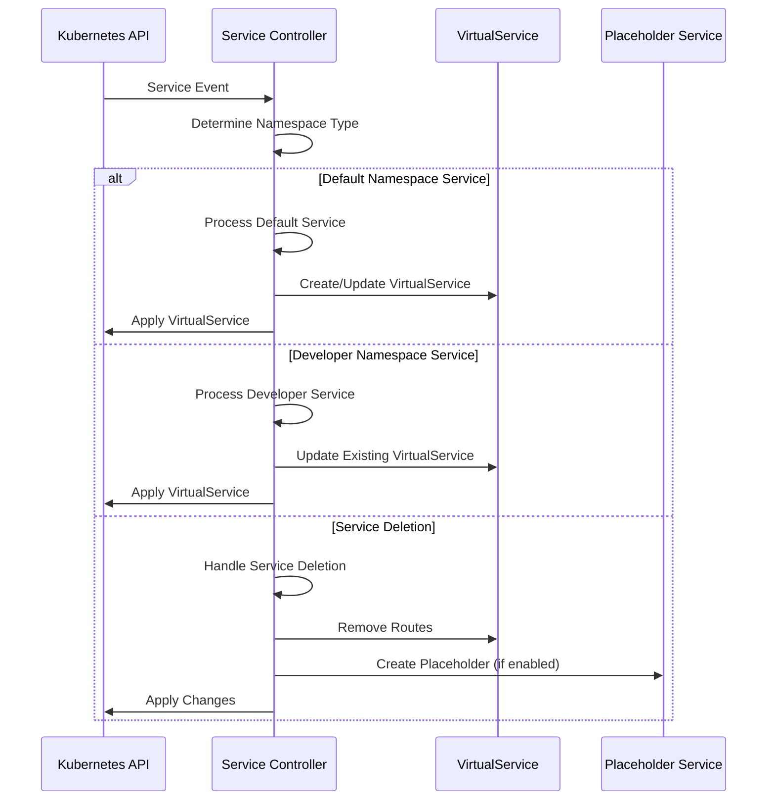

### 2. Configuration Manager

The Configuration Manager handles dynamic configuration loading and validation.

#### Configuration Structure
```go
type OperatorConfig struct {
    DefaultNamespace         string   `yaml:"defaultNamespace"`
    DeveloperNamespaces     []string `yaml:"developerNamespaces"`
    EnablePlaceholderServices bool    `yaml:"enablePlaceholderServices"`
    VirtualServiceTemplate  string   `yaml:"virtualServiceTemplate"`
}
```

#### Configuration Loading Process
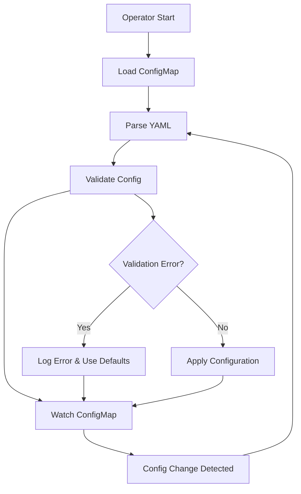

### 3. Template Engine

The Template Engine processes Go templates to generate VirtualService resources.

#### Template Processing
```go
type TemplateData struct {
    ServiceName        string
    ServiceNamespace   string
    DeveloperName      string
    DeveloperNamespace string
}

func (r *ServiceReconciler) processTemplate(templateStr string, data TemplateData) (*v1beta1.VirtualService, error) {
    tmpl, err := template.New("virtualservice").Parse(templateStr)
    if err != nil {
        return nil, fmt.Errorf("failed to parse template: %w", err)
    }
    
    var buf bytes.Buffer
    if err := tmpl.Execute(&buf, data); err != nil {
        return nil, fmt.Errorf("failed to execute template: %w", err)
    }
    
    vs := &v1beta1.VirtualService{}
    if err := yaml.Unmarshal(buf.Bytes(), vs); err != nil {
        return nil, fmt.Errorf("failed to unmarshal VirtualService: %w", err)
    }
    
    return vs, nil
}
```

#### Template Variable Resolution
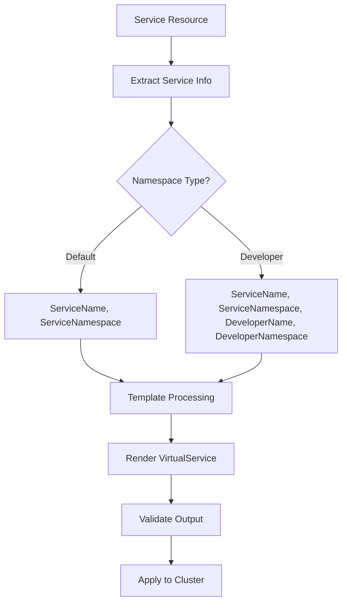

### 4. Placeholder Service Manager

Manages automatic creation and cleanup of placeholder services.

#### Placeholder Service Lifecycle
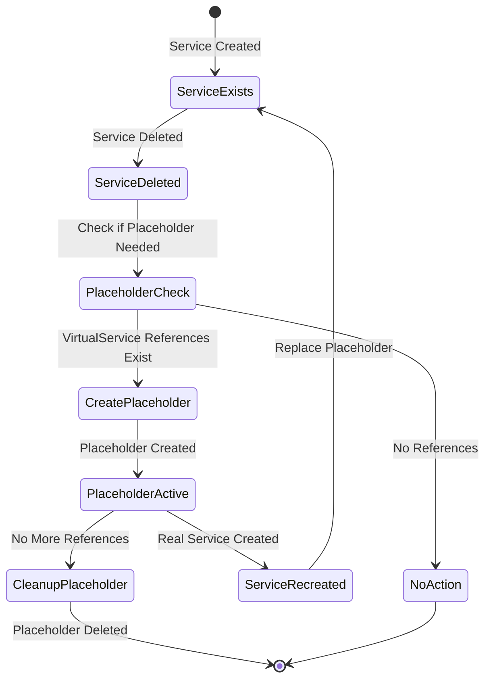

#### Placeholder Detection Logic
```go
func (r *ServiceReconciler) isPlaceholderService(service *corev1.Service) bool {
    if service.Annotations == nil {
        return false
    }
    
    placeholder, exists := service.Annotations["virtualservice-operator/placeholder-service"]
    return exists && placeholder == "true"
}

func (r *ServiceReconciler) createPlaceholderService(ctx context.Context, serviceName, namespace, sourceServiceFQDN string) error {
    placeholderService := &corev1.Service{
        ObjectMeta: metav1.ObjectMeta{
            Name:      serviceName,
            Namespace: namespace,
            Annotations: map[string]string{
                "virtualservice-operator/placeholder-service": "true",
                "virtualservice-operator/source-service":     sourceServiceFQDN,
            },
        },
        Spec: corev1.ServiceSpec{
            Type:         corev1.ServiceTypeExternalName,
            ExternalName: "placeholder.local",
        },
    }
    
    return r.Create(ctx, placeholderService)
}
```

## Design Patterns

### 1. Controller Pattern

The operator implements the standard Kubernetes controller pattern with the controller-runtime framework.

#### Controller Registration
```go
func (r *ServiceReconciler) SetupWithManager(mgr ctrl.Manager) error {
    return ctrl.NewControllerManagedBy(mgr).
        For(&corev1.Service{}).
        Owns(&v1beta1.VirtualService{}).
        Complete(r)
}
```

#### Reconciliation Logic
```go
func (r *ServiceReconciler) Reconcile(ctx context.Context, req ctrl.Request) (ctrl.Result, error) {
    log := log.FromContext(ctx)
    
    // Get the service
    service := &corev1.Service{}
    if err := r.Get(ctx, req.NamespacedName, service); err != nil {
        if errors.IsNotFound(err) {
            return r.handleServiceDeletion(ctx, req.Name, req.Namespace, r.Config)
        }
        return ctrl.Result{}, err
    }
    
    // Skip system services
    if r.isSystemService(service) {
        return ctrl.Result{}, nil
    }
    
    // Process based on namespace
    if service.Namespace == r.Config.DefaultNamespace {
        return r.handleDefaultNamespaceService(ctx, service, r.Config)
    }
    
    return r.handleDeveloperNamespaceService(ctx, service, r.Config)
}
```

### 2. Template Pattern

Uses Go templates for flexible VirtualService generation.

#### Template Inheritance
```yaml
# Base template
virtualServiceTemplate: |
  apiVersion: networking.istio.io/v1beta1
  kind: VirtualService
  metadata:
    name: "{{.ServiceName}}-virtual-service"
    namespace: "{{.ServiceNamespace}}"
  spec:
    hosts:
    - "{{.ServiceName}}.{{.ServiceNamespace}}.svc.cluster.local"
    http:
    {{- template "routing-rules" . }}

# Routing rules template
{{- define "routing-rules" }}
- match:
  - headers:
      x-developer:
        exact: "{{.DeveloperName}}"
  route:
  - destination:
      host: "{{.ServiceName}}.{{.DeveloperNamespace}}.svc.cluster.local"
- route:
  - destination:
      host: "{{.ServiceName}}.{{.ServiceNamespace}}.svc.cluster.local"
{{- end }}
```

### 3. Observer Pattern

Implements configuration watching for dynamic updates.

#### Configuration Watcher
```go
type ConfigWatcher struct {
    client     client.Client
    configMap  string
    namespace  string
    callback   func(*OperatorConfig)
    stopCh     chan struct{}
}

func (cw *ConfigWatcher) Start(ctx context.Context) error {
    informer, err := cache.NewInformer(
        &cache.ListWatch{
            ListFunc: func(options metav1.ListOptions) (runtime.Object, error) {
                return cw.client.CoreV1().ConfigMaps(cw.namespace).List(ctx, options)
            },
            WatchFunc: func(options metav1.ListOptions) (watch.Interface, error) {
                return cw.client.CoreV1().ConfigMaps(cw.namespace).Watch(ctx, options)
            },
        },
        &corev1.ConfigMap{},
        0,
        cache.ResourceEventHandlerFuncs{
            UpdateFunc: cw.handleConfigUpdate,
        },
    )
    
    if err != nil {
        return err
    }
    
    go informer.Run(cw.stopCh)
    return nil
}
```

### 4. Factory Pattern

Uses factory methods for creating different types of services and VirtualServices.

#### Service Factory
```go
type ServiceFactory struct {
    config *OperatorConfig
}

func (sf *ServiceFactory) CreateVirtualService(service *corev1.Service) (*v1beta1.VirtualService, error) {
    switch {
    case sf.isDefaultNamespaceService(service):
        return sf.createDefaultVirtualService(service)
    case sf.isDeveloperNamespaceService(service):
        return sf.createDeveloperVirtualService(service)
    default:
        return nil, fmt.Errorf("unsupported service type")
    }
}

func (sf *ServiceFactory) CreatePlaceholderService(name, namespace string) *corev1.Service {
    return &corev1.Service{
        ObjectMeta: metav1.ObjectMeta{
            Name:      name,
            Namespace: namespace,
            Annotations: map[string]string{
                "virtualservice-operator/placeholder-service": "true",
            },
        },
        Spec: corev1.ServiceSpec{
            Type:         corev1.ServiceTypeExternalName,
            ExternalName: "placeholder.local",
        },
    }
}
```

## Data Flow

### Service Creation Flow

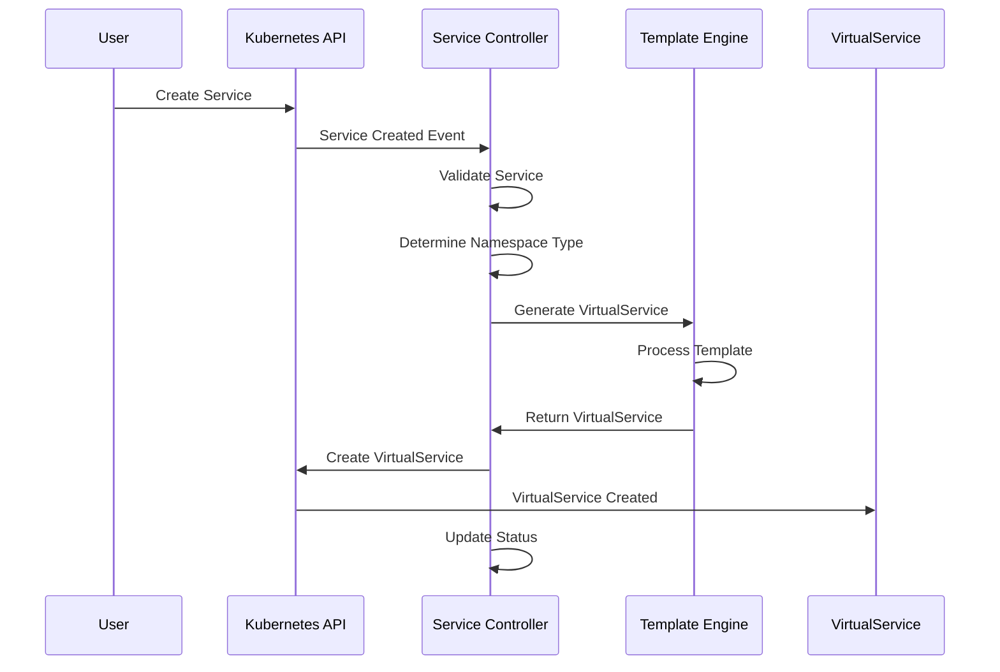

### Service Update Flow

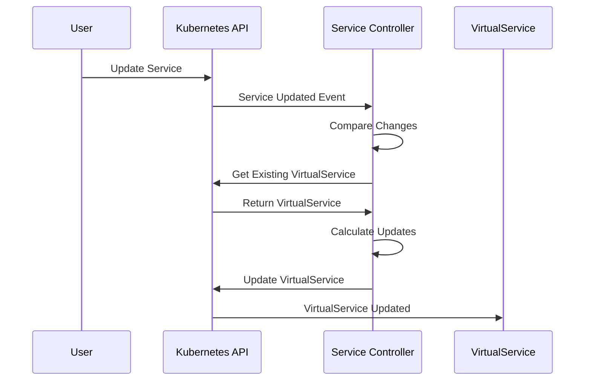

### Service Deletion Flow

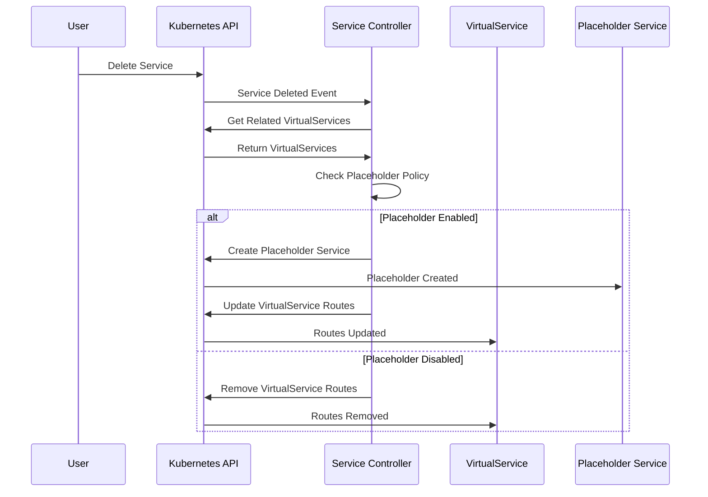

## Error Handling and Resilience

### Error Handling Strategy

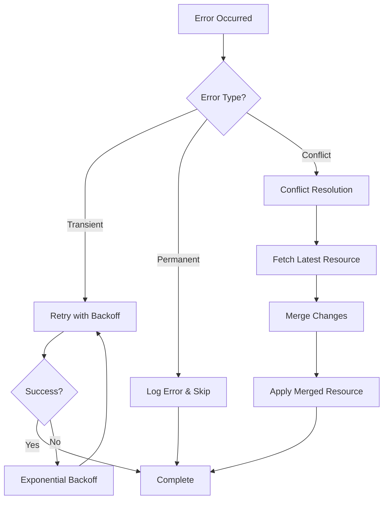

### Retry Logic Implementation

```go
func (r *ServiceReconciler) reconcileWithRetry(ctx context.Context, service *corev1.Service, maxRetries int) error {
    var lastErr error
    
    for attempt := 0; attempt < maxRetries; attempt++ {
        if err := r.reconcileService(ctx, service); err != nil {
            lastErr = err
            
            if errors.IsConflict(err) {
                // Handle conflict by refetching and retrying
                time.Sleep(time.Duration(attempt) * time.Second)
                continue
            }
            
            if isTransientError(err) {
                // Exponential backoff for transient errors
                backoff := time.Duration(1<<attempt) * time.Second
                time.Sleep(backoff)
                continue
            }
            
            // Permanent error, don't retry
            return err
        }
        
        return nil // Success
    }
    
    return fmt.Errorf("failed after %d attempts: %w", maxRetries, lastErr)
}

func isTransientError(err error) bool {
    return errors.IsServerTimeout(err) ||
           errors.IsServiceUnavailable(err) ||
           errors.IsTooManyRequests(err)
}
```

### Circuit Breaker Pattern

```go
type CircuitBreaker struct {
    maxFailures int
    resetTimeout time.Duration
    failures    int
    lastFailure time.Time
    state       CircuitState
    mutex       sync.RWMutex
}

type CircuitState int

const (
    Closed CircuitState = iota
    Open
    HalfOpen
)

func (cb *CircuitBreaker) Call(fn func() error) error {
    cb.mutex.RLock()
    state := cb.state
    cb.mutex.RUnlock()
    
    if state == Open {
        if time.Since(cb.lastFailure) > cb.resetTimeout {
            cb.setState(HalfOpen)
        } else {
            return fmt.Errorf("circuit breaker is open")
        }
    }
    
    err := fn()
    
    if err != nil {
        cb.recordFailure()
        return err
    }
    
    cb.recordSuccess()
    return nil
}
```

## Performance Optimization

### Resource Management

#### Memory Optimization
```go
// Use object pools for frequently allocated objects
var virtualServicePool = sync.Pool{
    New: func() interface{} {
        return &v1beta1.VirtualService{}
    },
}

func (r *ServiceReconciler) getVirtualService() *v1beta1.VirtualService {
    vs := virtualServicePool.Get().(*v1beta1.VirtualService)
    vs.Reset() // Reset to zero state
    return vs
}

func (r *ServiceReconciler) putVirtualService(vs *v1beta1.VirtualService) {
    virtualServicePool.Put(vs)
}
```

#### CPU Optimization
```go
// Use worker pools for concurrent processing
type WorkerPool struct {
    workers    int
    jobQueue   chan Job
    workerPool chan chan Job
    quit       chan bool
}

func (wp *WorkerPool) Start() {
    for i := 0; i < wp.workers; i++ {
        worker := NewWorker(wp.workerPool)
        worker.Start()
    }
    
    go wp.dispatch()
}

func (wp *WorkerPool) dispatch() {
    for {
        select {
        case job := <-wp.jobQueue:
            go func() {
                jobChannel := <-wp.workerPool
                jobChannel <- job
            }()
        case <-wp.quit:
            return
        }
    }
}
```

### Caching Strategy

```go
type ResourceCache struct {
    services       map[string]*corev1.Service
    virtualServices map[string]*v1beta1.VirtualService
    mutex          sync.RWMutex
    ttl            time.Duration
}

func (rc *ResourceCache) GetService(key string) (*corev1.Service, bool) {
    rc.mutex.RLock()
    defer rc.mutex.RUnlock()
    
    service, exists := rc.services[key]
    return service, exists
}

func (rc *ResourceCache) SetService(key string, service *corev1.Service) {
    rc.mutex.Lock()
    defer rc.mutex.Unlock()
    
    rc.services[key] = service.DeepCopy()
    
    // Schedule cleanup
    time.AfterFunc(rc.ttl, func() {
        rc.mutex.Lock()
        delete(rc.services, key)
        rc.mutex.Unlock()
    })
}
```

## Security Architecture

### RBAC Model

```yaml
apiVersion: rbac.authorization.k8s.io/v1
kind: ClusterRole
metadata:
  name: virtualservice-operator-role
rules:
# Service permissions
- apiGroups: [""]
  resources: ["services"]
  verbs: ["get", "list", "watch", "create", "update", "patch", "delete"]
# ConfigMap permissions (read-only)
- apiGroups: [""]
  resources: ["configmaps"]
  verbs: ["get", "list", "watch"]
# VirtualService permissions
- apiGroups: ["networking.istio.io"]
  resources: ["virtualservices"]
  verbs: ["get", "list", "watch", "create", "update", "patch", "delete"]
# Event permissions (for debugging)
- apiGroups: [""]
  resources: ["events"]
  verbs: ["create", "patch"]
```

### Security Boundaries

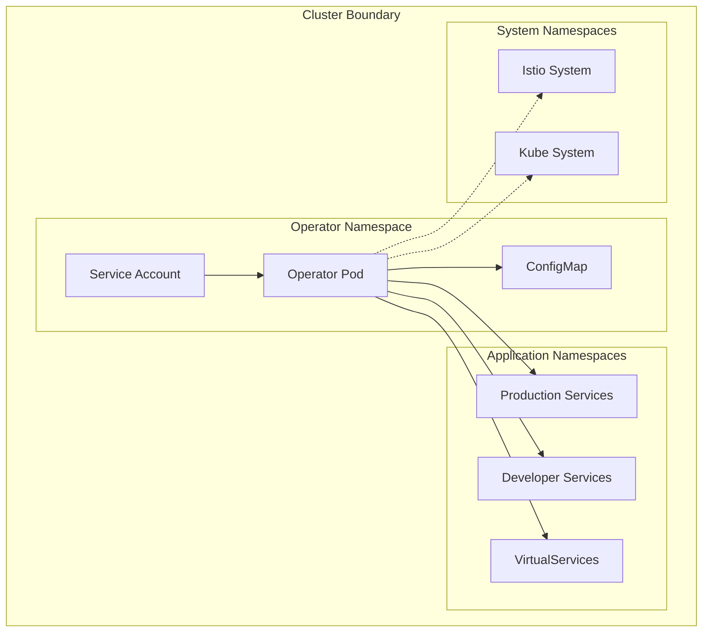

### Input Validation

```go
func (r *ServiceReconciler) validateService(service *corev1.Service) error {
    // Validate service name
    if !isValidKubernetesName(service.Name) {
        return fmt.Errorf("invalid service name: %s", service.Name)
    }
    
    // Validate namespace
    if !r.isAllowedNamespace(service.Namespace) {
        return fmt.Errorf("service in disallowed namespace: %s", service.Namespace)
    }
    
    // Validate ports
    for _, port := range service.Spec.Ports {
        if port.Port < 1 || port.Port > 65535 {
            return fmt.Errorf("invalid port number: %d", port.Port)
        }
    }
    
    return nil
}

func isValidKubernetesName(name string) bool {
    // RFC 1123 subdomain validation
    pattern := `^[a-z0-9]([-a-z0-9]*[a-z0-9])?$`
    matched, _ := regexp.MatchString(pattern, name)
    return matched && len(name) <= 63
}
```

## Monitoring and Observability

### Metrics Architecture

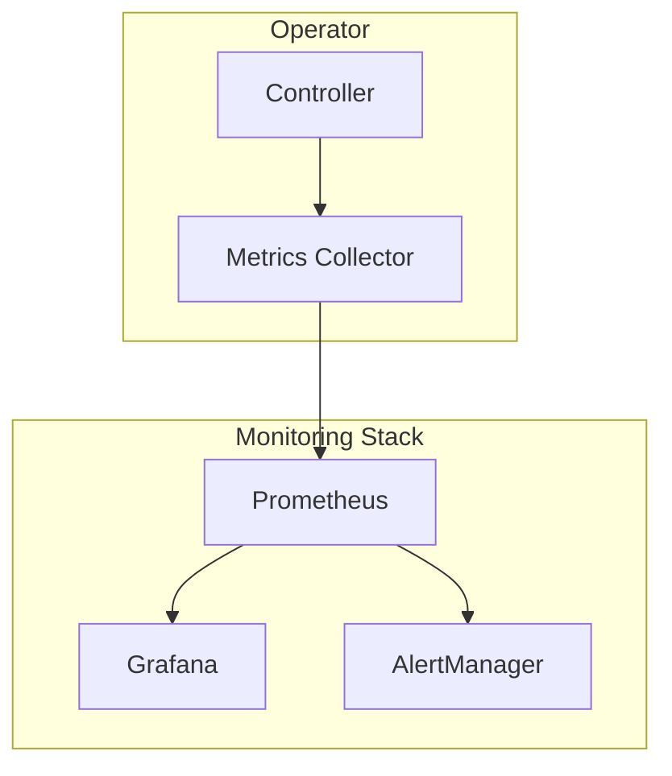

### Custom Metrics

```go
var (
    servicesProcessed = prometheus.NewCounterVec(
        prometheus.CounterOpts{
            Name: "virtualservice_operator_services_processed_total",
            Help: "Total number of services processed",
        },
        []string{"namespace", "action"},
    )
    
    virtualServicesCreated = prometheus.NewCounterVec(
        prometheus.CounterOpts{
            Name: "virtualservice_operator_virtualservices_created_total",
            Help: "Total number of VirtualServices created",
        },
        []string{"namespace"},
    )
    
    reconciliationDuration = prometheus.NewHistogramVec(
        prometheus.HistogramOpts{
            Name: "virtualservice_operator_reconciliation_duration_seconds",
            Help: "Time spent reconciling services",
            Buckets: prometheus.DefBuckets,
        },
        []string{"namespace", "result"},
    )
)

func init() {
    prometheus.MustRegister(servicesProcessed)
    prometheus.MustRegister(virtualServicesCreated)
    prometheus.MustRegister(reconciliationDuration)
}
```

### Distributed Tracing

```go
func (r *ServiceReconciler) Reconcile(ctx context.Context, req ctrl.Request) (ctrl.Result, error) {
    span, ctx := opentracing.StartSpanFromContext(ctx, "service-reconciliation")
    defer span.Finish()
    
    span.SetTag("service.name", req.Name)
    span.SetTag("service.namespace", req.Namespace)
    
    // Reconciliation logic
    result, err := r.reconcileService(ctx, req)
    
    if err != nil {
        span.SetTag("error", true)
        span.LogFields(log.Error(err))
    }
    
    return result, err
}
```

## Scalability Considerations

### Horizontal Scaling

```yaml
apiVersion: apps/v1
kind: Deployment
metadata:
  name: virtualservice-operator
spec:
  replicas: 3  # Multiple replicas for HA
  selector:
    matchLabels:
      app: virtualservice-operator
  template:
    spec:
      containers:
      - name: manager
        image: virtualservice-operator:latest
        env:
        - name: LEADER_ELECTION_ENABLED
          value: "true"
        - name: LEADER_ELECTION_ID
          value: "virtualservice-operator-leader"
```

### Leader Election

```go
func main() {
    mgr, err := ctrl.NewManager(ctrl.GetConfigOrDie(), ctrl.Options{
        Scheme:                 scheme,
        MetricsBindAddress:     metricsAddr,
        Port:                   9443,
        HealthProbeBindAddress: probeAddr,
        LeaderElection:         enableLeaderElection,
        LeaderElectionID:       "virtualservice-operator-leader",
    })
    
    if err != nil {
        setupLog.Error(err, "unable to start manager")
        os.Exit(1)
    }
}
```

### Resource Optimization

```go
// Implement resource limits and requests
resources:
  limits:
    cpu: 1000m
    memory: 1Gi
  requests:
    cpu: 100m
    memory: 128Mi

// Use efficient data structures
type ServiceIndex struct {
    byNamespace map[string]map[string]*corev1.Service
    byName      map[string]*corev1.Service
    mutex       sync.RWMutex
}

func (si *ServiceIndex) AddService(service *corev1.Service) {
    si.mutex.Lock()
    defer si.mutex.Unlock()
    
    if si.byNamespace[service.Namespace] == nil {
        si.byNamespace[service.Namespace] = make(map[string]*corev1.Service)
    }
    
    key := fmt.Sprintf("%s/%s", service.Namespace, service.Name)
    si.byNamespace[service.Namespace][service.Name] = service
    si.byName[key] = service
}
```

This architecture deep dive provides comprehensive technical details about the VirtualService Operator's design, implementation patterns, and operational considerations. The modular architecture ensures maintainability, scalability, and reliability while providing flexible configuration options for different deployment scenarios.