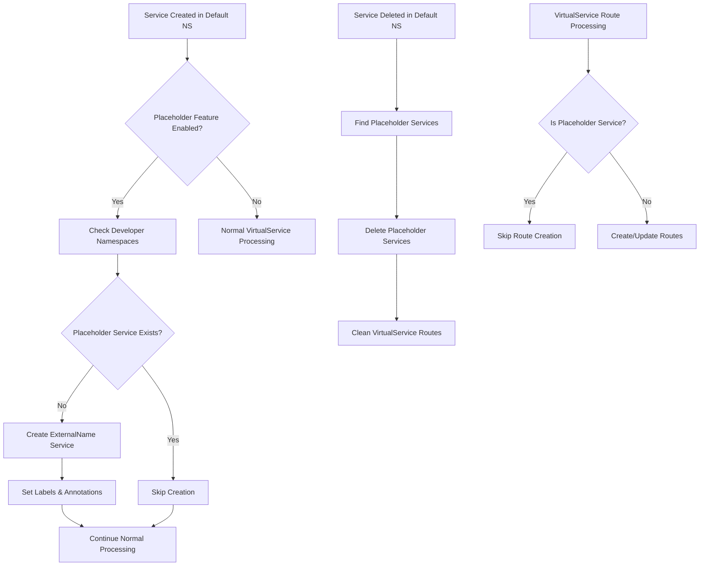

# Placeholder Service Management - Technical Specification

## 1. Product Overview

This specification defines the automatic placeholder service management functionality for the VirtualService operator. The feature automatically creates and manages ExternalName services in developer namespaces that mirror services from the default namespace, enabling seamless service discovery while maintaining proper traffic routing control.

The primary purpose is to provide automatic service mirroring across namespaces, allowing developers to reference services from the default namespace without manual service creation, while preventing unwanted VirtualService route creation for these placeholder services.

## 2. Core Features

### 2.1 User Roles

This feature operates at the operator level and does not introduce new user roles. All functionality is managed automatically by the VirtualService operator.

### 2.2 Feature Module

The placeholder service management functionality consists of the following main components:

1. **Placeholder Service Controller**: Automatic creation and lifecycle management of ExternalName services
2. **Service Filtering Logic**: Prevention of VirtualService route creation for placeholder services
3. **Configuration Management**: Enable/disable feature via ConfigMap
4. **Cleanup Handler**: Proper cleanup when source services are deleted

### 2.3 Page Details

| Component Name | Module Name | Feature Description |
|----------------|-------------|---------------------|
| Service Controller | Placeholder Creation Logic | Automatically create ExternalName services in developer namespaces when services are created in default namespace. Check for existing services to avoid conflicts. |
| Service Controller | Lifecycle Management | Delete placeholder services when source service is deleted. Handle service updates appropriately. |
| Service Controller | Route Filtering | Skip VirtualService route creation for services with `placeholder-service: "true"` label. |
| Config Manager | Feature Toggle | Add `enablePlaceholderServices` configuration option to ConfigMap. |
| Utils Package | Service Template | Generate standardized ExternalName service definitions with proper labels and annotations. |

## 3. Core Process

### Main Operation Flow

1. **Service Creation in Default Namespace**:
   - Operator detects new service in default namespace
   - Checks if placeholder service creation is enabled
   - For each developer namespace, creates ExternalName service pointing to original service
   - Skips creation if placeholder service already exists

2. **Service Deletion in Default Namespace**:
   - Operator detects service deletion in default namespace
   - Finds and deletes corresponding placeholder services in all developer namespaces
   - Cleans up VirtualService routes if they exist

3. **VirtualService Route Management**:
   - When processing services for VirtualService routes, check for placeholder service label
   - Skip route creation for services marked as placeholders
   - Continue normal processing for regular services



## 4. User Interface Design

### 4.1 Design Style

This feature operates at the infrastructure level and does not have a user interface. Configuration is managed through Kubernetes ConfigMap YAML definitions.

### 4.2 Configuration Interface

The feature is configured through the existing `virtualservice-operator-config` ConfigMap with the following addition:

```yaml
apiVersion: v1
kind: ConfigMap
metadata:
  name: virtualservice-operator-config
  namespace: virtualservice-operator-system
data:
  config.yaml: |
    defaultNamespace: "default"
    developerNamespaces:
      - "default-test"
      - "default-test2" 
      - "default-staging"
    enablePlaceholderServices: true  # New configuration option
    virtualServiceTemplate: |
      # ... existing template
```

### 4.3 Service Template Design

Placeholder services follow a standardized template:

```yaml
apiVersion: v1
kind: Service
metadata:
  name: {servicename}
  namespace: {developer-namespace}
  labels:
    managed-by: virtualservice-operator
    placeholder-service: "true"
    source-namespace: {default-namespace}
  annotations:
    virtualservice-operator/source-service: "{servicename}.{default-namespace}.svc.cluster.local"
    virtualservice-operator/created-at: "{timestamp}"
spec:
  type: ExternalName
  externalName: {servicename}.{default-namespace}.svc.cluster.local
```