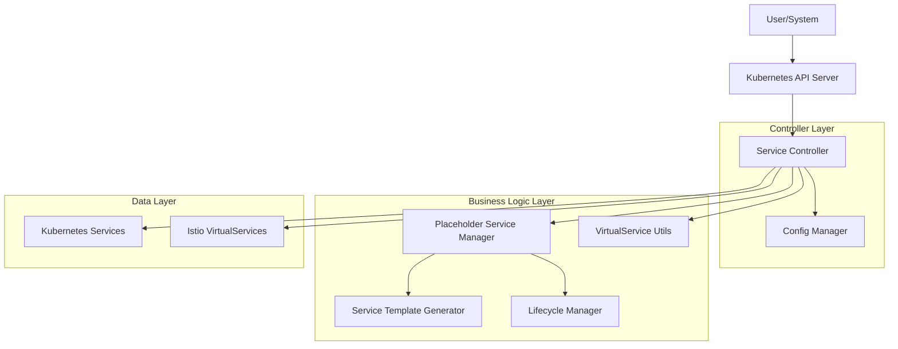
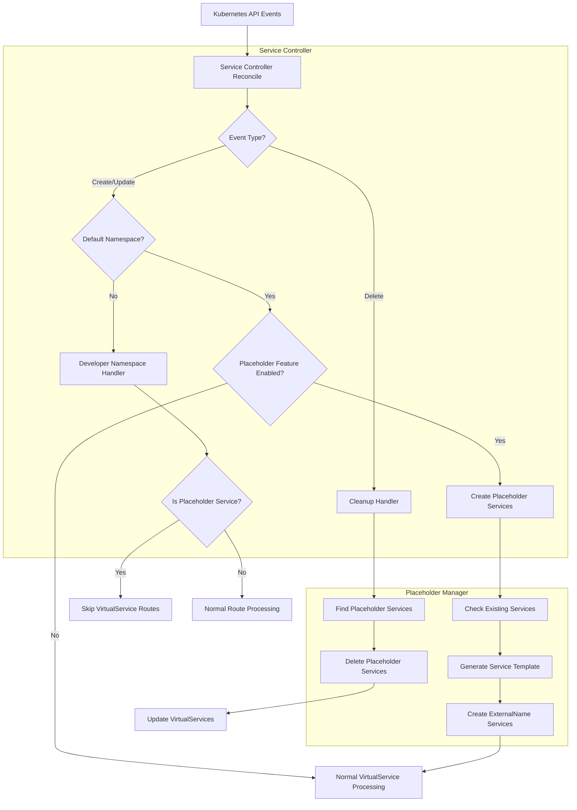
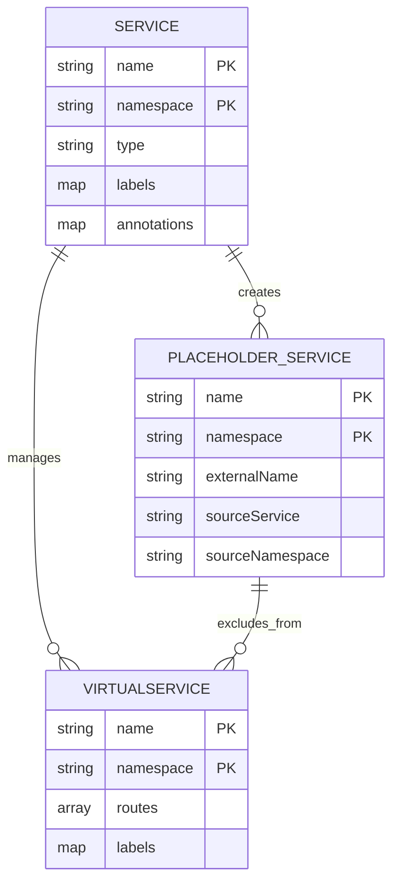

# Placeholder Service Management - Technical Architecture

## 1. Architecture Design



## 2. Technology Description

- Frontend: None (Infrastructure component)
- Backend: Go-based Kubernetes Operator using controller-runtime
- Dependencies: 
  - controller-runtime (Kubernetes operator framework)
  - Istio client-go (VirtualService management)
  - Kubernetes client-go (Service management)

## 3. Component Definitions

| Component | Purpose |
|-----------|---------|
| Service Controller | Main reconciliation loop handling service events |
| Placeholder Service Manager | Core logic for creating/managing ExternalName services |
| Service Template Generator | Generates standardized placeholder service definitions |
| Lifecycle Manager | Handles creation, updates, and deletion of placeholder services |
| Config Manager | Manages feature toggle and configuration |

## 4. API Definitions

### 4.1 Core Functions

**Placeholder Service Creation**
```go
func (r *ServiceReconciler) createPlaceholderServices(ctx context.Context, service *corev1.Service, config *config.OperatorConfig) error
```

Parameters:
| Param Name | Param Type | isRequired | Description |
|------------|------------|------------|-------------|
| ctx | context.Context | true | Request context |
| service | *corev1.Service | true | Source service from default namespace |
| config | *config.OperatorConfig | true | Operator configuration |

**Placeholder Service Cleanup**
```go
func (r *ServiceReconciler) cleanupPlaceholderServices(ctx context.Context, serviceName string, config *config.OperatorConfig) error
```

Parameters:
| Param Name | Param Type | isRequired | Description |
|------------|------------|------------|-------------|
| ctx | context.Context | true | Request context |
| serviceName | string | true | Name of the deleted service |
| config | *config.OperatorConfig | true | Operator configuration |

**Placeholder Service Detection**
```go
func (r *ServiceReconciler) isPlaceholderService(service *corev1.Service) bool
```

Parameters:
| Param Name | Param Type | isRequired | Description |
|------------|------------|------------|-------------|
| service | *corev1.Service | true | Service to check |

Returns: boolean indicating if service is a placeholder

### 4.2 Configuration API

**Configuration Structure**
```go
type OperatorConfig struct {
    DefaultNamespace         string   `yaml:"defaultNamespace"`
    DeveloperNamespaces     []string `yaml:"developerNamespaces"`
    EnablePlaceholderServices bool    `yaml:"enablePlaceholderServices"`
    VirtualServiceTemplate  string   `yaml:"virtualServiceTemplate"`
}
```

## 5. Server Architecture Diagram



## 6. Data Model

### 6.1 Data Model Definition



### 6.2 Service Template Definition

**Placeholder Service Template**
```yaml
apiVersion: v1
kind: Service
metadata:
  name: {{ .ServiceName }}
  namespace: {{ .DeveloperNamespace }}
  labels:
    managed-by: virtualservice-operator
    placeholder-service: "true"
    source-namespace: {{ .DefaultNamespace }}
    source-service: {{ .ServiceName }}
  annotations:
    virtualservice-operator/source-service: "{{ .ServiceName }}.{{ .DefaultNamespace }}.svc.cluster.local"
    virtualservice-operator/created-at: {{ .Timestamp }}
    virtualservice-operator/version: "v1.2.4"
spec:
  type: ExternalName
  externalName: {{ .ServiceName }}.{{ .DefaultNamespace }}.svc.cluster.local
```

**Configuration Schema**
```yaml
# ConfigMap: virtualservice-operator-config
apiVersion: v1
kind: ConfigMap
metadata:
  name: virtualservice-operator-config
  namespace: virtualservice-operator-system
data:
  config.yaml: |
    defaultNamespace: "default"
    developerNamespaces:
      - "default-test"
      - "default-test2"
      - "default-staging"
    enablePlaceholderServices: true
    virtualServiceTemplate: |
      # VirtualService template content
```

## 7. Implementation Strategy

### 7.1 Phase 1: Core Infrastructure
1. Add `enablePlaceholderServices` configuration option
2. Implement placeholder service detection logic
3. Create service template generator
4. Add basic placeholder service creation

### 7.2 Phase 2: Lifecycle Management
1. Implement placeholder service cleanup on deletion
2. Add conflict resolution for existing services
3. Integrate with VirtualService route filtering
4. Add comprehensive error handling

### 7.3 Phase 3: Optimization
1. Add batch operations for multiple namespaces
2. Implement caching for improved performance
3. Add metrics and monitoring
4. Comprehensive testing and validation

## 8. Integration Points

### 8.1 Existing Controller Integration
- Modify `handleDefaultNamespaceService` to create placeholder services
- Update `handleServiceDeletion` to cleanup placeholder services
- Enhance `handleDeveloperNamespaceService` to skip placeholder services

### 8.2 Configuration Integration
- Extend `OperatorConfig` struct with new field
- Update `ConfigManager.GetConfig()` to parse new option
- Add validation for configuration values

### 8.3 Utility Integration
- Add new utility functions for placeholder service management
- Integrate with existing retry logic for conflict resolution
- Extend logging and error handling patterns