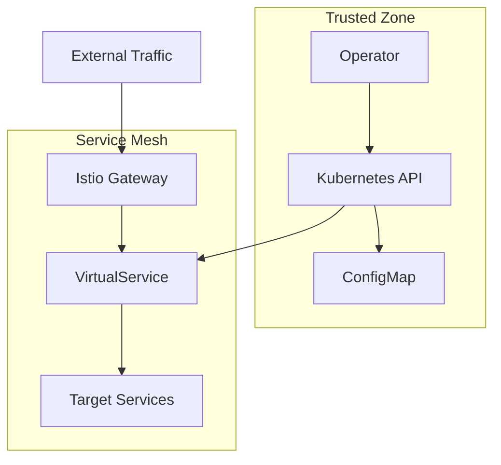

# VirtualService Operator - Security Guide

## Overview

This document outlines security considerations, best practices, and hardening procedures for the VirtualService Operator deployment and operation.

## Security Architecture

### Threat Model

#### Assets
- **Kubernetes API Server**: Primary target for unauthorized access
- **Istio VirtualServices**: Control traffic routing and can impact service availability
- **Service Discovery**: Placeholder services could be exploited for traffic interception
- **Configuration Data**: ConfigMaps contain routing logic and namespace mappings
- **Operator Credentials**: Service account tokens and RBAC permissions

#### Threats
- **Privilege Escalation**: Operator permissions being exploited
- **Traffic Interception**: Malicious services intercepting routed traffic
- **Configuration Tampering**: Unauthorized modification of routing rules
- **Resource Exhaustion**: DoS attacks through excessive resource creation
- **Information Disclosure**: Sensitive routing information exposure

#### Trust Boundaries


## RBAC Configuration

### Principle of Least Privilege

The operator follows the principle of least privilege with minimal required permissions:

```yaml
apiVersion: rbac.authorization.k8s.io/v1
kind: ClusterRole
metadata:
  name: virtualservice-operator-role
rules:
# Service management - required for service discovery
- apiGroups: [""]
  resources: ["services"]
  verbs: ["get", "list", "watch", "create", "update", "patch", "delete"]
  
# ConfigMap access - required for configuration
- apiGroups: [""]
  resources: ["configmaps"]
  verbs: ["get", "list", "watch"]
  
# VirtualService management - core functionality
- apiGroups: ["networking.istio.io"]
  resources: ["virtualservices"]
  verbs: ["get", "list", "watch", "create", "update", "patch", "delete"]
  
# Leader election - required for HA deployments
- apiGroups: ["coordination.k8s.io"]
  resources: ["leases"]
  verbs: ["get", "list", "watch", "create", "update", "patch", "delete"]
```

### RBAC Hardening

#### Namespace-Scoped Permissions (Recommended)
For enhanced security, consider using namespace-scoped permissions instead of cluster-wide:

```yaml
# Create Role per namespace instead of ClusterRole
apiVersion: rbac.authorization.k8s.io/v1
kind: Role
metadata:
  namespace: production
  name: virtualservice-operator-role-production
rules:
- apiGroups: [""]
  resources: ["services"]
  verbs: ["get", "list", "watch", "create", "update", "patch", "delete"]
- apiGroups: ["networking.istio.io"]
  resources: ["virtualservices"]
  verbs: ["get", "list", "watch", "create", "update", "patch", "delete"]
---
apiVersion: rbac.authorization.k8s.io/v1
kind: RoleBinding
metadata:
  name: virtualservice-operator-rolebinding-production
  namespace: production
subjects:
- kind: ServiceAccount
  name: virtualservice-operator
  namespace: virtualservice-operator-system
roleRef:
  kind: Role
  name: virtualservice-operator-role-production
  apiGroup: rbac.authorization.k8s.io
```

#### Resource Name Restrictions
Restrict access to specific resource names where possible:

```yaml
# Restrict ConfigMap access to specific ConfigMap
- apiGroups: [""]
  resources: ["configmaps"]
  resourceNames: ["virtualservice-operator-config"]
  verbs: ["get", "list", "watch"]
```

### RBAC Auditing

#### Regular Permission Review
```bash
# Review current permissions
kubectl describe clusterrole virtualservice-operator-role

# Check effective permissions
kubectl auth can-i --list --as=system:serviceaccount:virtualservice-operator-system:virtualservice-operator

# Audit service account usage
kubectl get rolebindings,clusterrolebindings -A -o wide | grep virtualservice-operator

# Check for unused permissions
kubectl get events -A --field-selector reason=Forbidden | grep virtualservice-operator
```

#### Permission Monitoring
```bash
# Monitor RBAC denials
kubectl get events -A --field-selector reason=Forbidden --watch

# Audit API access
kubectl logs -n kube-system kube-apiserver-* | grep virtualservice-operator

# Check for privilege escalation attempts
kubectl get events -A --field-selector reason=FailedCreate,reason=FailedUpdate | grep virtualservice-operator
```

## Network Security

### Network Policies

#### Operator Network Isolation
```yaml
apiVersion: networking.k8s.io/v1
kind: NetworkPolicy
metadata:
  name: virtualservice-operator-netpol
  namespace: virtualservice-operator-system
spec:
  podSelector:
    matchLabels:
      app: virtualservice-operator
  policyTypes:
  - Ingress
  - Egress
  
  # Restrict ingress to health checks and metrics
  ingress:
  - from:
    - namespaceSelector:
        matchLabels:
          name: monitoring  # Allow monitoring namespace
    ports:
    - protocol: TCP
      port: 8080  # Metrics
  - from: []  # Allow health checks from kubelet
    ports:
    - protocol: TCP
      port: 8081  # Health checks
  
  # Restrict egress to Kubernetes API and DNS
  egress:
  - to: []  # Allow all egress for Kubernetes API access
    ports:
    - protocol: TCP
      port: 443  # Kubernetes API
    - protocol: TCP
      port: 6443  # Kubernetes API (alternative port)
  - to: []  # Allow DNS resolution
    ports:
    - protocol: UDP
      port: 53
    - protocol: TCP
      port: 53
```

#### Service Mesh Security
```yaml
# Istio PeerAuthentication for operator
apiVersion: security.istio.io/v1beta1
kind: PeerAuthentication
metadata:
  name: virtualservice-operator-pa
  namespace: virtualservice-operator-system
spec:
  selector:
    matchLabels:
      app: virtualservice-operator
  mtls:
    mode: STRICT
```

### TLS Configuration

#### Secure Metrics Endpoint
```yaml
# Add TLS to metrics endpoint
apiVersion: v1
kind: Secret
metadata:
  name: operator-tls
  namespace: virtualservice-operator-system
type: kubernetes.io/tls
data:
  tls.crt: <base64-encoded-cert>
  tls.key: <base64-encoded-key>
---
# Update deployment to use TLS
spec:
  template:
    spec:
      containers:
      - name: manager
        args:
        - -metrics-bind-address=:8443
        - -metrics-secure=true
        volumeMounts:
        - name: tls-certs
          mountPath: /etc/certs
          readOnly: true
      volumes:
      - name: tls-certs
        secret:
          secretName: operator-tls
```

## Container Security

### Image Security

#### Image Scanning
```bash
# Scan operator image for vulnerabilities
docker run --rm -v /var/run/docker.sock:/var/run/docker.sock \
  aquasec/trivy image harbor.intent.ai/library/virtualservice-operator:v1.3.0

# Check for known vulnerabilities
grype harbor.intent.ai/library/virtualservice-operator:v1.3.0

# Verify image signatures (if using cosign)
cosign verify harbor.intent.ai/library/virtualservice-operator:v1.3.0
```

#### Image Policy
```yaml
# OPA Gatekeeper policy for image requirements
apiVersion: templates.gatekeeper.sh/v1beta1
kind: ConstraintTemplate
metadata:
  name: requiredimageregistry
spec:
  crd:
    spec:
      names:
        kind: RequiredImageRegistry
      validation:
        properties:
          registries:
            type: array
            items:
              type: string
  targets:
    - target: admission.k8s.gatekeeper.sh
      rego: |
        package requiredimageregistry
        
        violation[{"msg": msg}] {
          container := input.review.object.spec.template.spec.containers[_]
          not starts_with(container.image, input.parameters.registries[_])
          msg := sprintf("Image '%v' is not from approved registry", [container.image])
        }
---
apiVersion: constraints.gatekeeper.sh/v1beta1
kind: RequiredImageRegistry
metadata:
  name: operator-image-registry
spec:
  match:
    kinds:
      - apiGroups: ["apps"]
        kinds: ["Deployment"]
    namespaces: ["virtualservice-operator-system"]
  parameters:
    registries:
      - "harbor.intent.ai/library/"
```

### Runtime Security

#### Security Context
The operator uses a hardened security context:

```yaml
securityContext:
  # Pod-level security context
  runAsNonRoot: true
  seccompProfile:
    type: RuntimeDefault
  fsGroup: 65532

containers:
- name: manager
  securityContext:
    # Container-level security context
    allowPrivilegeEscalation: false
    capabilities:
      drop:
      - ALL
    readOnlyRootFilesystem: true
    runAsNonRoot: true
    runAsUser: 65532
    runAsGroup: 65532
```

#### Resource Limits
```yaml
resources:
  limits:
    cpu: 500m
    memory: 256Mi
    ephemeral-storage: 1Gi
  requests:
    cpu: 10m
    memory: 64Mi
    ephemeral-storage: 100Mi
```

#### Pod Security Standards
```yaml
# Apply Pod Security Standards
apiVersion: v1
kind: Namespace
metadata:
  name: virtualservice-operator-system
  labels:
    pod-security.kubernetes.io/enforce: restricted
    pod-security.kubernetes.io/audit: restricted
    pod-security.kubernetes.io/warn: restricted
```

## Configuration Security

### ConfigMap Security

#### Access Control
```yaml
# Restrict ConfigMap access
apiVersion: rbac.authorization.k8s.io/v1
kind: Role
metadata:
  namespace: virtualservice-operator-system
  name: configmap-reader
rules:
- apiGroups: [""]
  resources: ["configmaps"]
  resourceNames: ["virtualservice-operator-config"]
  verbs: ["get", "list", "watch"]
```

#### Configuration Validation
```bash
# Validate configuration before applying
kubectl apply --dry-run=client -f config.yaml

# Use admission controllers for validation
kubectl apply -f - <<EOF
apiVersion: admissionregistration.k8s.io/v1
kind: ValidatingAdmissionWebhook
metadata:
  name: virtualservice-operator-config-validator
webhooks:
- name: config.virtualservice-operator.io
  clientConfig:
    service:
      name: config-validator
      namespace: virtualservice-operator-system
      path: /validate
  rules:
  - operations: ["CREATE", "UPDATE"]
    apiGroups: [""]
    apiVersions: ["v1"]
    resources: ["configmaps"]
  namespaceSelector:
    matchLabels:
      name: virtualservice-operator-system
EOF
```

### Secrets Management

#### Sensitive Configuration
For sensitive configuration data, use Secrets instead of ConfigMaps:

```yaml
apiVersion: v1
kind: Secret
metadata:
  name: virtualservice-operator-secrets
  namespace: virtualservice-operator-system
type: Opaque
data:
  api-key: <base64-encoded-api-key>
  webhook-secret: <base64-encoded-webhook-secret>
```

#### External Secrets Integration
```yaml
# Using External Secrets Operator
apiVersion: external-secrets.io/v1beta1
kind: SecretStore
metadata:
  name: vault-backend
  namespace: virtualservice-operator-system
spec:
  provider:
    vault:
      server: "https://vault.example.com"
      path: "secret"
      version: "v2"
      auth:
        kubernetes:
          mountPath: "kubernetes"
          role: "virtualservice-operator"
---
apiVersion: external-secrets.io/v1beta1
kind: ExternalSecret
metadata:
  name: operator-secrets
  namespace: virtualservice-operator-system
spec:
  refreshInterval: 1h
  secretStoreRef:
    name: vault-backend
    kind: SecretStore
  target:
    name: virtualservice-operator-secrets
    creationPolicy: Owner
  data:
  - secretKey: api-key
    remoteRef:
      key: virtualservice-operator
      property: api-key
```

## Monitoring and Alerting

### Security Monitoring

#### Audit Logging
```yaml
# Enable audit logging for operator resources
apiVersion: audit.k8s.io/v1
kind: Policy
rules:
- level: Metadata
  namespaces: ["virtualservice-operator-system"]
  resources:
  - group: ""
    resources: ["configmaps", "secrets"]
  - group: "networking.istio.io"
    resources: ["virtualservices"]
  - group: ""
    resources: ["services"]
```

#### Security Alerts
```yaml
# Prometheus alerting rules
groups:
- name: virtualservice-operator-security
  rules:
  - alert: OperatorUnauthorizedAccess
    expr: increase(apiserver_audit_total{objectRef_namespace="virtualservice-operator-system",verb!~"get|list|watch"}[5m]) > 0
    for: 0m
    labels:
      severity: warning
    annotations:
      summary: "Unauthorized access to operator resources"
      
  - alert: OperatorConfigMapModified
    expr: increase(kube_configmap_info{namespace="virtualservice-operator-system",configmap="virtualservice-operator-config"}[5m]) > 0
    for: 0m
    labels:
      severity: critical
    annotations:
      summary: "Operator configuration modified"
      
  - alert: OperatorRBACViolation
    expr: increase(apiserver_audit_total{objectRef_namespace="virtualservice-operator-system",responseStatus_code=~"403|401"}[5m]) > 0
    for: 0m
    labels:
      severity: warning
    annotations:
      summary: "RBAC violation detected for operator"
```

### Compliance Monitoring

#### CIS Kubernetes Benchmark
```bash
# Run kube-bench for CIS compliance
kubectl apply -f https://raw.githubusercontent.com/aquasecurity/kube-bench/main/job.yaml

# Check operator-specific compliance
kubectl logs job/kube-bench | grep -A 10 -B 10 "virtualservice-operator"
```

#### NIST Framework Alignment
- **Identify**: Asset inventory and risk assessment
- **Protect**: Access controls and security policies
- **Detect**: Monitoring and alerting
- **Respond**: Incident response procedures
- **Recover**: Backup and recovery processes

## Incident Response

### Security Incident Procedures

#### Immediate Response
```bash
# 1. Isolate the operator
kubectl scale deployment virtualservice-operator --replicas=0 -n virtualservice-operator-system

# 2. Preserve evidence
kubectl get events -A --sort-by='.lastTimestamp' > security-events.log
kubectl logs -n virtualservice-operator-system deployment/virtualservice-operator --previous > operator-logs.log

# 3. Assess impact
kubectl get virtualservices -A -l managed-by=virtualservice-operator
kubectl get services -A -l "virtualservice-operator/placeholder-service=true"

# 4. Notify stakeholders
echo "Security incident detected in virtualservice-operator at $(date)" | mail -s "Security Alert" security-team@company.com
```

#### Investigation
```bash
# Check for unauthorized changes
kubectl get virtualservices -A -o yaml | grep -A 5 -B 5 "lastModified\|resourceVersion"

# Audit configuration changes
kubectl get configmap virtualservice-operator-config -n virtualservice-operator-system -o yaml

# Check for privilege escalation
kubectl auth can-i --list --as=system:serviceaccount:virtualservice-operator-system:virtualservice-operator

# Review network connections
kubectl get networkpolicies -A
kubectl describe networkpolicy virtualservice-operator-netpol -n virtualservice-operator-system
```

#### Recovery
```bash
# 1. Apply security patches
kubectl set image deployment/virtualservice-operator manager=harbor.intent.ai/library/virtualservice-operator:v1.3.1-security -n virtualservice-operator-system

# 2. Rotate credentials
kubectl delete secret operator-tls -n virtualservice-operator-system
kubectl create secret tls operator-tls --cert=new-cert.pem --key=new-key.pem -n virtualservice-operator-system

# 3. Reset configuration
kubectl apply -f secure-config.yaml

# 4. Restart operator
kubectl rollout restart deployment/virtualservice-operator -n virtualservice-operator-system

# 5. Verify security posture
kubectl get pods -n virtualservice-operator-system
kubectl logs -n virtualservice-operator-system deployment/virtualservice-operator
```

## Security Best Practices

### Development Security

#### Secure Coding Practices
- Input validation for all configuration parameters
- Proper error handling without information disclosure
- Secure defaults for all configuration options
- Regular dependency updates and vulnerability scanning

#### Code Review Checklist
- [ ] RBAC permissions follow least privilege
- [ ] No hardcoded secrets or credentials
- [ ] Input validation for all external data
- [ ] Proper error handling and logging
- [ ] Security context properly configured
- [ ] Resource limits defined
- [ ] Network policies applied

### Deployment Security

#### Pre-deployment Checklist
- [ ] Image vulnerability scan passed
- [ ] RBAC permissions reviewed and approved
- [ ] Network policies configured
- [ ] Security context hardened
- [ ] Resource limits set
- [ ] Monitoring and alerting configured
- [ ] Backup and recovery procedures tested

#### Post-deployment Verification
```bash
# Verify security configuration
kubectl get deployment virtualservice-operator -n virtualservice-operator-system -o yaml | grep -A 20 securityContext

# Check RBAC permissions
kubectl auth can-i --list --as=system:serviceaccount:virtualservice-operator-system:virtualservice-operator

# Verify network policies
kubectl describe networkpolicy virtualservice-operator-netpol -n virtualservice-operator-system

# Test security controls
kubectl exec -n virtualservice-operator-system deployment/virtualservice-operator -- whoami
kubectl exec -n virtualservice-operator-system deployment/virtualservice-operator -- ls -la /
```

### Operational Security

#### Regular Security Tasks
- Weekly vulnerability scans
- Monthly RBAC permission reviews
- Quarterly security assessments
- Annual penetration testing

#### Security Maintenance
```bash
# Update operator image
kubectl set image deployment/virtualservice-operator manager=harbor.intent.ai/library/virtualservice-operator:latest -n virtualservice-operator-system

# Rotate TLS certificates
kubectl create secret tls operator-tls-new --cert=cert.pem --key=key.pem -n virtualservice-operator-system
kubectl patch deployment virtualservice-operator -n virtualservice-operator-system --patch '{"spec":{"template":{"spec":{"volumes":[{"name":"tls-certs","secret":{"secretName":"operator-tls-new"}}]}}}}'

# Review and update RBAC
kubectl apply -f updated-rbac.yaml

# Update network policies
kubectl apply -f updated-netpol.yaml
```

## Compliance and Governance

### Regulatory Compliance

#### SOC 2 Type II
- Access controls and authentication
- System monitoring and logging
- Change management procedures
- Incident response processes

#### ISO 27001
- Information security management system
- Risk assessment and treatment
- Security controls implementation
- Continuous improvement processes

### Governance Framework

#### Security Policies
- Access control policy
- Change management policy
- Incident response policy
- Data protection policy

#### Procedures and Standards
- Deployment procedures
- Configuration standards
- Monitoring procedures
- Audit procedures

#### Documentation Requirements
- Security architecture documentation
- Risk assessment reports
- Compliance audit reports
- Incident response reports